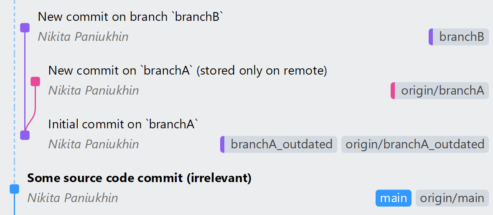
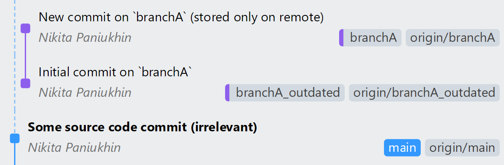

<h1 align="center">Git Conflict Detector</h1>

This project identifies files that have been independently modified in both the remote (`origin/branchA`) and local (`branchB`) branches since their last common ancestor (merge base). It avoids fetching the remote branch and instead retrieves the necessary remote changes via the GitHub API.

## Demo

This repository contains demo branches that simulate the scenario described in the project’s specification.
After setting up the demo as outlined below, the resulting structure will be as follows:

- An expected merge-base commit (referred to as `branchA_outdated`).
- A remote-only branch `branchA` which is one commit ahead of the expected merge-base commit.
  Although the project specification allows for a local `branchA` that might not be synchronized with the remote `origin/branchA`, in this demo, we do not need any information from the local branch, so I removed it entirely to demonstrate that I am not using it.
- A local-only branch `branchB` which is one commit ahead of the expected merge-base commit.

For your convenience, here is a visual representation:




### Prerequisites
- Python 3 (tested with 3.13) and Git should be installed on your local machine

### Setup

1. Clone the repository to your local machine
2. Install Python dependencies:
  ```bash
  pip install -r requirements.txt
  ```

3. Set up the Git structure by running the provided `setup` script (`setup.cmd` or `./setup.sh`)

  <details>
  <summary>Here is a visualization of the Git structure before and after the setup, for reference (click)</summary>

  <br>
  <div align="center"><b>Before setup</b></div>
  

  <br>
  <br>
  <div align="center"><b>After setup</b></div>
  

  </details>

3. Run the script with the demo arguments. `get_diff.cmd` and `./get_diff.sh` are provided for your convenience. For example:
  ```bash
  ./get_diff.sh origin/branchA branchB npanuhin edu-JetBrains-Git-Conflict-Detector {my_github_token}
  # or
  python3 get_diff.py origin/branchA branchB npanuhin edu-JetBrains-Git-Conflict-Detector {my_github_token}
  ```

4. If you want to reset Git structure to the initial state, you can either run `rollback.cmd` or `./rollback.sh` or clone the repository again

<details>
<summary>Personal remarks about the setup process</summary>

> Since different tools and pipelines might be used for tasks like cloning repositories and setting up Python environments (e.g., using virtualenv), I haven't provided a universal setup script. I hope this doesn't cause any inconvenience 😇
>
> However, here's an example script you can use to setup the demo:
> ```bash
> git clone git@github.com:npanuhin/edu-JetBrains-Git-Conflict-Detector.git
> cd edu-JetBrains-Git-Conflict-Detector
> pip install -r -U requirements.txt
> setup
> ```

</details>
